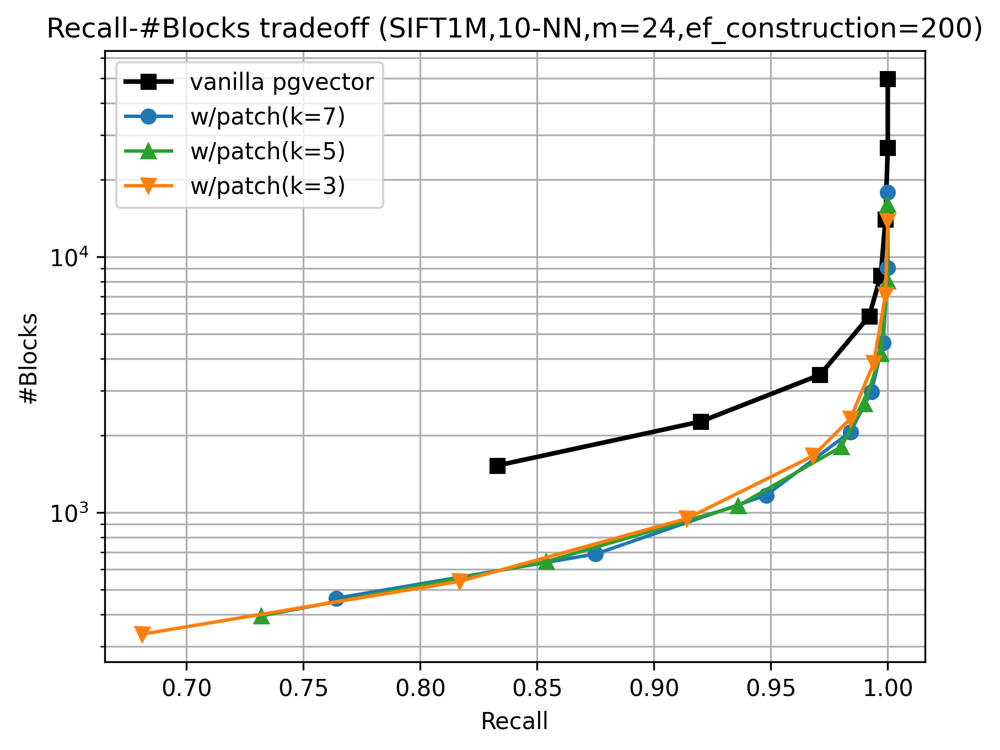

[](https://github.com/maropu/pgvector_hnsw_candidate_pruning_patch/actions/workflows/BuildAndTests.yml)
[](https://github.com/maropu/pgvector_hnsw_candidate_pruning_patch/actions/workflows/ExtensionDistribution.yml)

## What this patch does and how to apply it?

This patch adds a candidate pruning logic to [pgvector](https://github.com/pgvector/pgvector)'s HNSW [1] implementation whose design is based on PASE [2].
PASE is an index structure for approximate nearest neighbor search, implemented as an external extension to a general-purpose RDBMS (PostgreSQL),
that follows the graph-based HNSW search algorithm. Since data structures in an RDBMS are typically managed as fixed-size disk blocks
(e.g., 8 KiB in PostgreSQL), a key feature of PASE is that it organizes the graph’s vertices and edges to align naturally with these disk blocks.

The search algorithm proposed in the HNSW paper [1] proceeds greedily: for a vertex representing a vector, it computes distances
between all of its adjacent candidate vectices and the query, then iteratively moves to the neighbor that most reduces the distance to the query.
In pgvector, which follows the PASE’s design, these adjacent vertices are often located on different disk blocks, leading to frequent random block accesses during search.
This becomes a major issue in an RDBMS, where sophisticated concurrency control for transaction processing makes both I/O overhead and lock contention critical concerns.
To mitigate this, the patch embeds metadata into each vertex that allows estimating distances between its neighbors and the query
without reading the disk blocks containing those neighbors.
Specifically, Each vertex tuple in a disk block stores 16 bytes of per-neighbor metadata:
(1) a 96-bit SimHash [3] of the $d$-dimensional edge vector $\Delta = (n - c)$, and (2) the edge length $\lVert \Delta \rVert$ (a single-precision floating-point value).
Here, $c \in \mathbb{R}^d$ is the current vertex vector, $n \in \mathbb{R}^d$ is a neighbor vector, and $q \in \mathbb{R}^d$ is the query vector; let $v = (q - c)$.

At search time, it computes the SimHash of the query vector $v$ and estimates the angle $\hat{\theta}$ between $v$ and the edge vector $\Delta$ from their Hamming distance.
It computes all the angles and then sorts neighbor candidates by estimated distance $\widehat{d}(q,n)$ computed from the cosine theorem. 
By using this estimated distance, the search can prioritize neighbors without fetching the disk blocks that contain their vectors.
Specifically, candidate neighbors are first sorted in ascending order of $\widehat{d}(q,n)$,
and only the top-k neighbors (k=3 by default) are accessed from other disk blocks to compute their exact distances.
This strategy implemented in the patch results in reducing random I/O and lock contention in PostgreSQL.

This strategy is well-known as the two-level search with hybrid distance [4] or the two-stage search strategy [6,7], but differs in that
they employ product quantization (PQ) [5] for distance estimation.
In contrast, the patch adopts SimHash, as its fixed-length bit representation is more compact and
computationally lighter than the compressed vectors produced by PQ.

Apply the patch to pgvector and compile it as described below:

```shell
// Cehckout pgvector v0.8.0
$ git clone --depth 1 https://github.com/pgvector/pgvector.git
$ cd pgvector
$ git fetch --tags --depth 1 origin "v0.8.0"
$ git checkout "v0.8.0"

// Compile and install pgvector w/the patch
$ patch -p1 < pgvector_v0.8.0_hnsw_candidate_pruning.patch
$ make
$ make install
```

Note that **this patch is incompatible with the pgvector’s original index data format** because it adds 16 bytes per-neighbor metadata, and
it currently supports only the L2 distance (vector_l2_ops) on single-precision floating-point vectors.

### Additional options

#### Index options

Specify HNSW additional one index parameters

- `neighbor_metadata` - whether to store neighbor metadata to estimate distances (on by default)

```sql
CREATE INDEX ON items USING hnsw (embedding vector_l2_ops) WITH (m = 16, ef_construction = 64, neighbor_metadata = on);
```

#### Query options

Specify HNSW additional two query parameters

- `hnsw.candidate_pruning` - enables candidate pruning for faster scans (on by default)
- `hnsw.distance_computation_topk ` - sets the number of neighbors to compute precise distances when using distance estimation (3 by default)

```sql
SET hnsw.distance_computation_topk = 3;
```

A higher value provides better recall at the cost of block accesses.

## Benchmark results

An evaluation compared the patch with the vanilla pgvector by measuring the number of block accesses required to achieve different levels of recall.
At Recall≈0.95, the patch achieved a reduction in block accesses of approximately 59% when k=7. The improvement became even more pronounced as recall approached 1.0,
where block accesses were reduced by about 72% for k=3, 68% for k=5, and 64% for k=7. These results indicate that the patch provides a consistent reduction
in block read while maintaining accuracy, with the benefits observed in the high-recall regime.



## TODO

 - Improve the patch to further reduce the number of blocks read
 - Add benchmark results showing the recall-TPS (transactions per second) tradeoff and include them in the section **"Benchmark results"**
 - Document the implementation details and design considerations of this patch in the section **"Detailed design of this patch"**
 - Implement an alternative candidate pruning strategy using PQ; address the issue that the PQ codebook size (~1KB × dimension) exceeds PostgreSQL’s 8KiB page limit and devise an appropriate solution


## References

 - [1] Yu A. Malkov and D. A. Yashunin. 2020. Efficient and Robust Approximate Nearest Neighbor Search Using Hierarchical Navigable Small World Graphs. IEEE Trans. Pattern Anal. Mach. Intell. 42, 4 (April 2020), 824–836. https://doi.org/10.1109/TPAMI.2018.2889473.
 - [2] Wen Yang, Tao Li, Gai Fang, and Hong Wei. 2020. PASE: PostgreSQL Ultra-High-Dimensional Approximate Nearest Neighbor Search Extension. In Proceedings of the 2020 ACM SIGMOD International Conference on Management of Data (SIGMOD '20). Association for Computing Machinery, New York, NY, USA, 2241–2253. https://doi.org/10.1145/3318464.3386131.
 - [3] Moses S. Charikar. 2002. Similarity estimation techniques from rounding algorithms. In Proceedings of the thiry-fourth annual ACM symposium on Theory of computing (STOC '02). Association for Computing Machinery, New York, NY, USA, 380–388. https://doi.org/10.1145/509907.509965.
 - [4] Yichuan Wang, Shu Liu, Zhifei Li, Yongji Wu, Ziming Mao, Yilong Zhao, Xiao Yan, Zhiying Xu, Yang Zhou, Ion Stoica, Sewon Min, Matei Zaharia, and Joseph E. Gonzalez. 2025. LEANN: A Low-Storage Vector Index. arXiv preprint arXiv:2506.08276.
 - [5] Herve Jégou, Matthijs Douze, and Cordelia Schmid. 2011. Product Quantization for Nearest Neighbor Search. IEEE Transactions on Pattern Analysis and Machine Intelligence 33, 1 (2011), 117–128.
 - [6] M. Douze, A. Sablayrolles and H. Jégou, "Link and Code: Fast Indexing with Graphs and Compact Regression Codes," 2018 IEEE/CVF Conference on Computer Vision and Pattern Recognition, Salt Lake City, UT, USA, 2018, pp. 3646-3654, doi: 10.1109/CVPR.2018.00384.
 - [7] H. Jégou, R. Tavenard, M. Douze and L. Amsaleg, "Searching in one billion vectors: Re-rank with source coding," 2011 IEEE International Conference on Acoustics, Speech and Signal Processing (ICASSP), Prague, Czech Republic, 2011, pp. 861-864, doi: 10.1109/ICASSP.2011.5946540.

