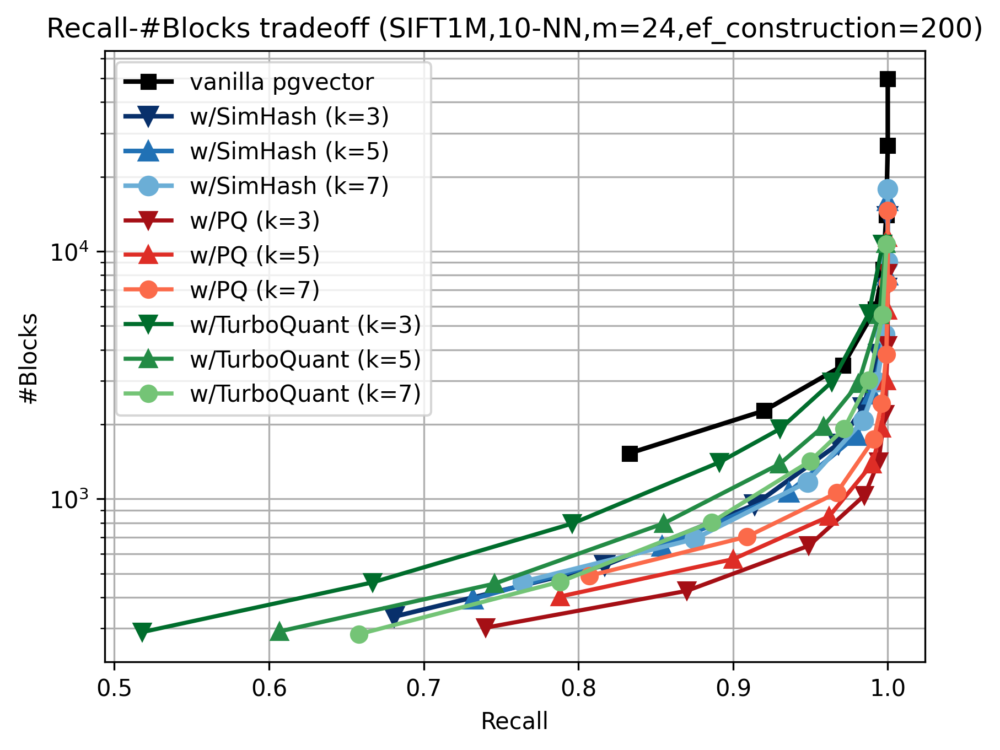

[](https://github.com/maropu/pgvector_hnsw_candidate_pruning_patch/actions/workflows/BuildAndTests.yml)
[](https://github.com/maropu/pgvector_hnsw_candidate_pruning_patch/actions/workflows/ExtensionDistribution.yml)

## What this patch does and how to apply it?

This patch adds a candidate pruning logic to [pgvector](https://github.com/pgvector/pgvector)'s HNSW [1] implementation whose design is based on PASE [2].
PASE is an index structure for approximate nearest neighbor search, implemented as an external extension to a general-purpose RDBMS (PostgreSQL),
that follows the graph-based HNSW search algorithm. Since data structures in an RDBMS are typically managed as fixed-size disk blocks
(e.g., 8 KiB in PostgreSQL), a key feature of PASE is that it organizes the graph’s vertices and edges to align naturally with these disk blocks.

The search algorithm proposed in the HNSW paper [1] proceeds greedily: for a vertex representing a vector, it computes distances
between all of its adjacent candidate vectices and the query, then iteratively moves to the neighbor that most reduces the distance to the query.
In pgvector, which follows the PASE’s design, these adjacent vertices are often located on different disk blocks, leading to frequent random block accesses during search.
This becomes a major issue in an RDBMS, where sophisticated concurrency control for transaction processing makes both I/O overhead and lock contention critical concerns.
To mitigate this, this work provides two alternative patches that embed per-neighbor metadata into each vertex and use it to estimate distances to the query
without reading the disk blocks containing those neighbors. Neighbors of the current vertex are first ranked by an estimated distance $\hat d(q,n)$,
and only the top-k are fetched to compute exact distances; this reduces random I/O and contention while preserving accuracy.
This strategy is well known in earlier work as two-level search with hybrid distance [4] or re-ranking [6,7,8].

The first patch adopts a SimHash-based estimator: each vertex tuple stores 16 bytes of per-neighbor metadata consisting of a 96-bit SimHash [3] of the edge vector $\Delta = (n - c)$ and
the edge length $\|\Delta\|$. At query time, it computes the SimHash of the query offset $v = (q - c)$, estimates the angle $\hat{\theta}$ between $v$ and $\Delta$
from their Hamming distance, and derives an estimated $L_2$ distance $\hat d(q,n)$ via the cosine theorem.
Here, $c \in \mathbb{R}^d$ is the current vertex vector, $n \in \mathbb{R}^d$ is a neighbor vector, and $q \in \mathbb{R}^d$ is the query vector.
This design is training-free, compact, and computationally light.

Alternatively, the second patch employs Product Quantization (PQ) [5] as the estimator. The neighbor vector $n$ is split into $M$ equal-length parts $n_1,\ldots,n_M$.
For each part $j$, the index stores a one-byte code that identifies the nearest centroid in a learned codebook $C_j$ with $k$ centroids.
At query time, the PQ code is simply decoded: for each part $j$ we read the corresponding centroid and reconstruct an approximate neighbor $\tilde{n}$ by concatenating these centroids.
The estimated distance is then $\hat{d}(q,n) = \| q - \tilde{n} \|$.
Neighbors are ranked by $\hat{d}(q,n)$ and, as in the first patch, only the top-k are fetched to compute exact distances.
Compared to SimHash, PQ offers stronger estimation at the cost of build-time training and additional storage for codebooks.

Apply the patches to pgvector and compile them as described below:

```shell
// Cehckout pgvector v0.8.0
$ git clone --depth 1 https://github.com/pgvector/pgvector.git
$ cd pgvector
$ git fetch --tags --depth 1 origin "v0.8.0"
$ git checkout "v0.8.0"
```

The SimHash-based patch:
```shell
// Compile and install pgvector w/the the SimHash-based patch
$ patch -p1 < pgvector_v0.8.0_hnsw_candidate_pruning_simhash.patch
$ make
$ make install
```

The PQ-based patch:
```shell
// Compile and install pgvector w/the PQ-based patch
$ patch -p1 < pgvector_v0.8.0_hnsw_candidate_pruning_pq.patch
$ make
$ make install
```

Note that **this patch is incompatible with the pgvector’s original index data format** because it adds 16 bytes per-neighbor metadata, and
it currently supports only the L2 distance (vector_l2_ops) on single-precision floating-point vectors.

### Additional options

#### Index options

Specify HNSW additional one index parameter:

- `neighbor_metadata` - whether to store neighbor metadata to estimate distances (on by default)

```sql
CREATE INDEX ON items USING hnsw (embedding vector_l2_ops) WITH (m = 16, ef_construction = 64, neighbor_metadata = on);
```

#### Query options

Specify HNSW additional two query parameters:

- `hnsw.candidate_pruning` - enables candidate pruning for faster scans (on by default)
- `hnsw.distance_computation_topk ` - sets the number of neighbors to compute precise distances when using distance estimation (3 by default)

```sql
SET hnsw.distance_computation_topk = 3;
```

A higher value provides better recall at the cost of block accesses.

## Benchmark results

An evaluation compared the patch with the vanilla pgvector by measuring the number of block accesses required to achieve different levels of recall.
At Recall≈0.95, the patch achieved a reduction in block accesses of approximately 59% when k=7. The improvement became even more pronounced as recall approached 1.0,
where block accesses were reduced by about 72% for k=3, 68% for k=5, and 64% for k=7. These results indicate that the patch provides a consistent reduction
in block read while maintaining accuracy, with the benefits observed in the high-recall regime.



## TODO

 - Improve the patches to further reduce the number of blocks read
 - Add benchmark results showing the recall-TPS (transactions per second) tradeoff and include them in the section **"Benchmark results"**

## References

 - [1] Yu A. Malkov and D. A. Yashunin. 2020. Efficient and Robust Approximate Nearest Neighbor Search Using Hierarchical Navigable Small World Graphs. IEEE Trans. Pattern Anal. Mach. Intell. 42, 4 (April 2020), 824–836. https://doi.org/10.1109/TPAMI.2018.2889473.
 - [2] Wen Yang, Tao Li, Gai Fang, and Hong Wei. 2020. PASE: PostgreSQL Ultra-High-Dimensional Approximate Nearest Neighbor Search Extension. In Proceedings of the 2020 ACM SIGMOD International Conference on Management of Data (SIGMOD '20). Association for Computing Machinery, New York, NY, USA, 2241–2253. https://doi.org/10.1145/3318464.3386131.
 - [3] Moses S. Charikar. 2002. Similarity estimation techniques from rounding algorithms. In Proceedings of the thiry-fourth annual ACM symposium on Theory of computing (STOC '02). Association for Computing Machinery, New York, NY, USA, 380–388. https://doi.org/10.1145/509907.509965.
 - [4] Yichuan Wang, Shu Liu, Zhifei Li, Yongji Wu, Ziming Mao, Yilong Zhao, Xiao Yan, Zhiying Xu, Yang Zhou, Ion Stoica, Sewon Min, Matei Zaharia, and Joseph E. Gonzalez. 2025. LEANN: A Low-Storage Vector Index. arXiv preprint arXiv:2506.08276.
 - [5] Herve Jégou, Matthijs Douze, and Cordelia Schmid. 2011. Product Quantization for Nearest Neighbor Search. IEEE Transactions on Pattern Analysis and Machine Intelligence 33, 1 (2011), 117–128.
 - [6] Matthijs Douze, Alexandre Sablayrolles, and Hervé Jégou. 2018. Link and Code: Fast Indexing with Graphs and Compact Regression Codes. In Proceedings of the 2018 IEEE/CVF Conference on Computer Vision and Pattern Recognition (CVPR 2018). IEEE, 3646–3654. https://doi.org/10.1109/CVPR.2018.00384.
 - [7] Hervé Jégou, Romain Tavenard, Matthijs Douze, and Laurent Amsaleg. 2011. Searching in one billion vectors: Re-rank with source coding. In Proceedings of the 2011 IEEE International Conference on Acoustics, Speech and Signal Processing (ICASSP 2011). IEEE, 861–864. https://doi.org/10.1109/ICASSP.2011.5946540.
 - [8] Herve Jégou, Matthijs Douze, and Cordelia Schmid. 2011. Product Quantization for Nearest Neighbor Search. IEEE Transactions on Pattern Analysis and Machine Intelligence 33, 1 (2011), 117–128. https://doi.org/10.1109/TPAMI.2010.57.
